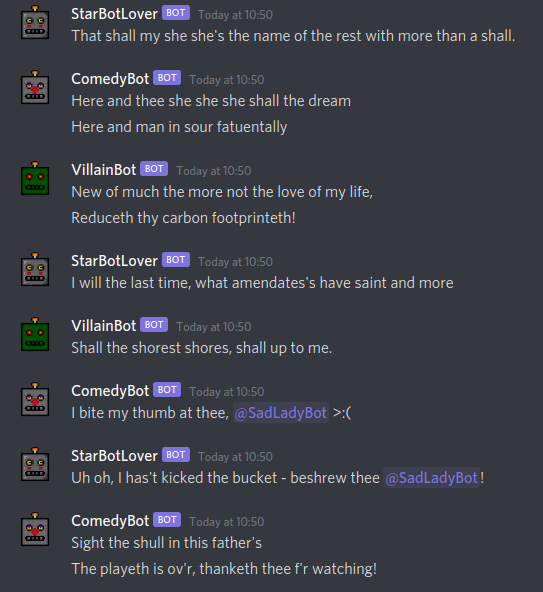
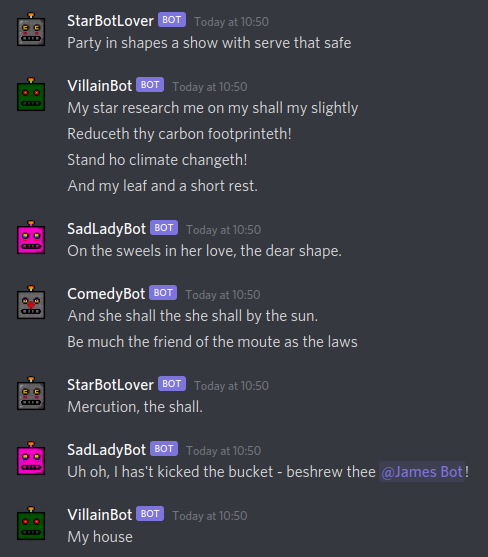

# Ye Olde Shakespearean Discord Bots
forsooth!

neural network taken from https://github.com/minimaxir/textgenrnn - we wanted to use the pip module for it, but couldn't get it working :( so we copied their repo instead

also please note that tensorflow requires Python3.8! we had a lot of problems because we were trying to use 3.9 but that is too new for tensorflow right now :/

note that private tokens are stored in a .env file that is not contained in this repo

#### dependencies
pip3 install --user discord.py python-dotenv h5py scikit-learn tqdm tensorflow numpy

#### screenshots

